# Web Interface — Stepper-Plucked-Strings-GMB

> Sources: `SPECIFICATION.md` §9, §10, §18, §19, §20 · `STRING_FRET_SELECTION.md` §14–16 · `SYSEX_CAPABILITIES.md` §17–18.
> Related documents: [`ARCHITECTURE.md`](ARCHITECTURE.md) · [`PIN_CONFIGURATION.md`](PIN_CONFIGURATION.md) · [`MIDI_PROTOCOL.md`](MIDI_PROTOCOL.md) · [`FIRST_CONFIGURATION.md`](FIRST_CONFIGURATION.md) · [`../hardware/POWER_AND_SAFETY.md`](../hardware/POWER_AND_SAFETY.md).

The web interface lets a beginner configure and play the instrument without
touching the source, from a computer, tablet or phone. It is served from the
ESP32's LittleFS, is vanilla JS with no build step, and needs no cloud.

> **Every screenshot below is generated from the real interface**, running its
> built-in mock backend (a 4-string GCEA ukulele). Regenerate them with
> `node web-interface/tools/screenshots.js` — see §6.

---

## 1. Three pages, one modal

The interface is **three main pages** plus a Settings modal behind the gear
button, top-right. There is no "simplified / advanced" toggle any more: the
interface is the simplified one, and the details that used to hide behind expert
mode are simply on the page where they belong.

| Page | What it is for |
| ---- | -------------- |
| **Instrument** | play it, watch where every carriage is, and see why it will not play |
| **Setup** | build the instrument, in order, from identity to validation |
| **Wiring & GPIO** | the harness, the power & safety circuit, I²C, pins, commissioning |
| *Settings modal* | the profile library, device settings, diagnostics and bench tools |

Disclosure is **local, not modal**. A global Simplified/Advanced switch makes the
one field you need at the bench unreachable and doubles every page into two
variants to maintain, so instead each step shows the handful of decisions it owns
and folds its fine tuning into a block you open on the spot. Nothing is ever out
of reach. Safety-relevant fields — the LIMIT endstop, the E-stop declarations —
stay in plain sight regardless of how rarely they are touched.

A red **STOP** button sits at the bottom of the sidebar on every page. It calls
`POST /api/panic`, which is deliberately unauthenticated — a stop must never fail
because of a token ([`SAFETY.md`](SAFETY.md)).

---

## 2. Instrument

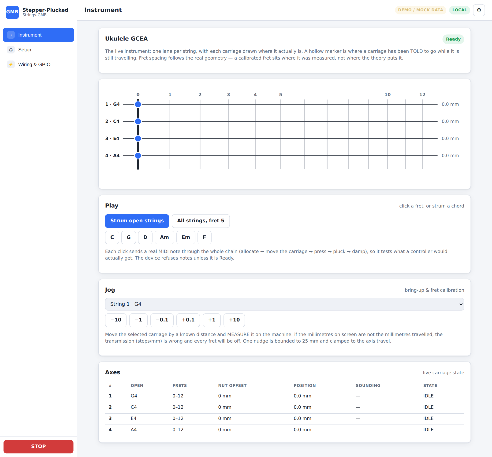

The servo-per-fret sibling project draws a map of *which finger to press*. On
this machine one carriage per string slides to the fret, so the useful thing to
show is **where each carriage is**:

* **one lane per string**, laid out by the real geometry (`GMB.fretAbsoluteMm`),
  so a calibrated fret sits where it was *measured*, not where theory puts it;
* a **solid marker** at the live position, fed by `/ws/status`, and a **hollow
  ghost** at the commanded target while the carriage is still travelling;
* the millimetre readout per string, and an **Axes** table with the open note,
  fret range, nut offset, live position, the note currently sounding and the
  axis state (a faulted axis is flagged and its lane goes dashed).

At the top, four readings that decide whether the machine will do anything at
all — state, axes ready, notes sounding, MIDI input — and, when something is
wrong, the **faults themselves, listed**, with *Clear faults & re-home* next to
them. This used to be one pill in a heading with the detail behind the Settings
modal; when the instrument will not play, "why" belongs on the page you are
already looking at. A device that booted config-safe says so here and offers the
two pages that fix it.

**Play** — clicking a fret sends a real MIDI note through `/api/test/note`, so it
exercises the entire chain (allocate → move the carriage → press → pluck → damp)
rather than poking one actuator. Strum and chord buttons play several strings
together. The device refuses notes unless it is `Ready`.

**Jog** — nudge one carriage by ±0.1 / ±1 / ±10 mm. This is the bring-up and
fret-calibration tool: move a known distance and **measure it on the machine**.
If the millimetres on screen are not the millimetres travelled, the transmission
(steps/mm) is wrong and every fret will be off by the same ratio. The firmware
bounds one nudge to 25 mm, clamps it to the axis travel, and refuses it unless
the axis is homed, idle and un-faulted.

---

## 3. Setup — nine steps

The whole instrument creation, in order. Per-string steps show **one string at a
time** through a string-tab strip, so a 6-string instrument stays navigable.

| Step | Content |
| ---- | ------- |
| 1 **Identification** | name, description, string count, instrument type, proposed tuning, max frets, capo, announced polyphony |
| 2 **Board** | ESP32 model → available / reserved / recommended GPIOs; four board profiles are built in |
| 3 **Pins** | automatic assignment, or manual with per-signal capability filtering |
| 4 **Mechanics** | per string: axis enabled, scale length, transmission, motor polarity, max speed & acceleration, and a **jog ±1/±5 mm** to check the direction live; *Copy mechanics to all strings* |
| 5 **Homing** | per axis: HOME pin & active level, search direction, zero offset, speeds, back-off, timeout, LIMIT pin & level; *Home all axes now*, *Copy homing to all* |
| 6 **Servos** | per servo: source (PCA bus/board/channel or direct GPIO), rest / active / mute pulses, travel & settle, disable-at-rest, stroke shaping, engage delay, and a **Test strike** |
| 7 **Notes** | per string a **fret offset from the HOME endstop** that shifts the whole fretboard, automatic fret computation, then a **sequential calibration assistant** (§3.2) |
| 8 **Test** | motors, sensors, fingers, plectrums, a note, a string, a chord, the emergency stop |
| 9 **Validation** | "valid" or a precise list of problems; nothing is armed until the critical errors are fixed |

<details>
<summary>Screenshots of each step</summary>

| | |
| --- | --- |
| 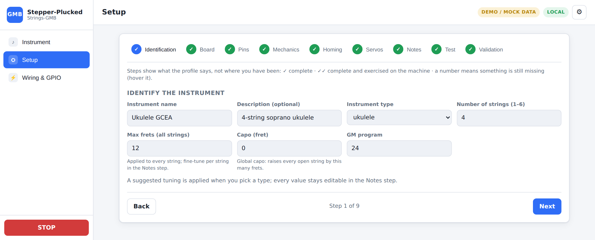 | 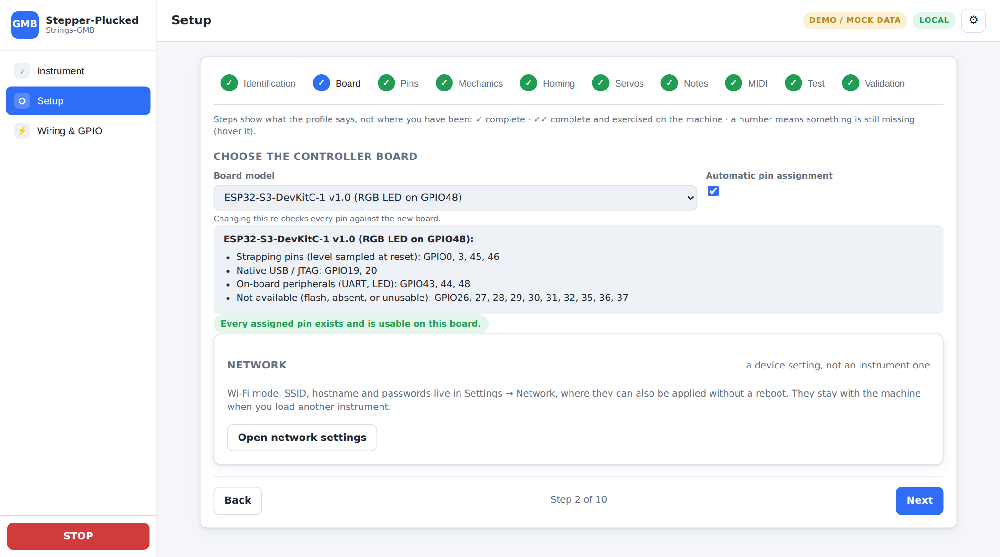 |
| 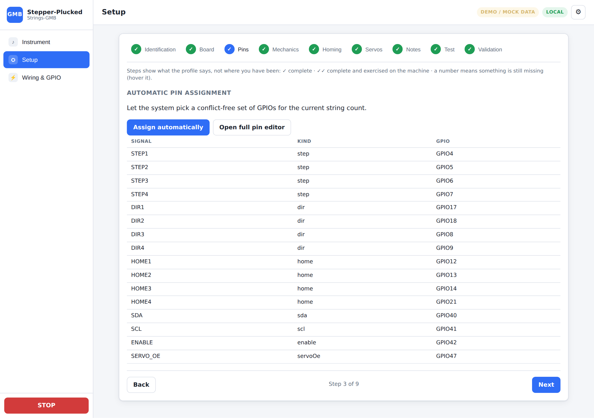 | 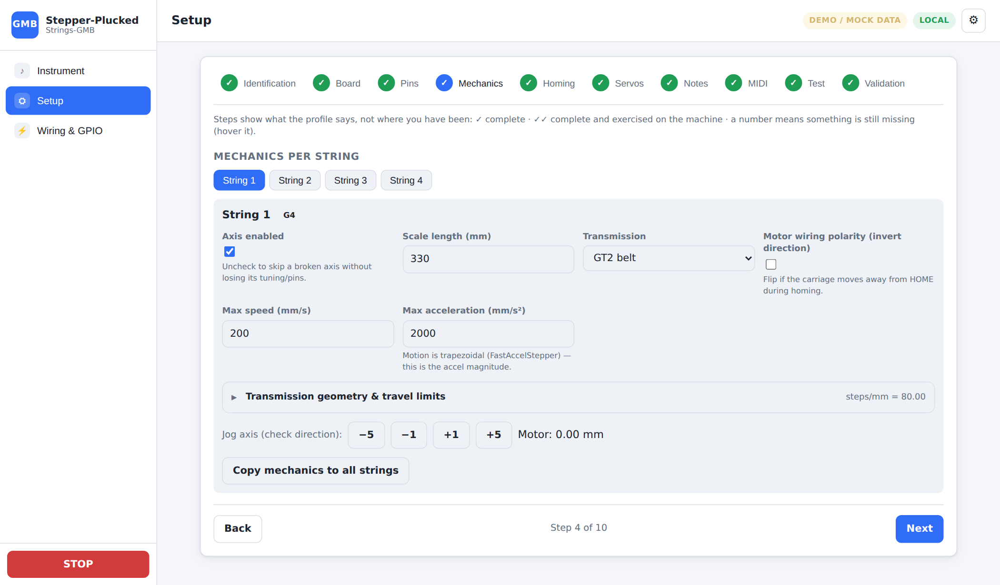 |
| 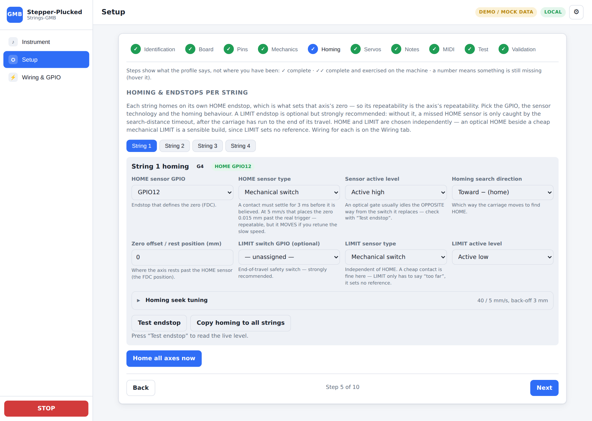 | 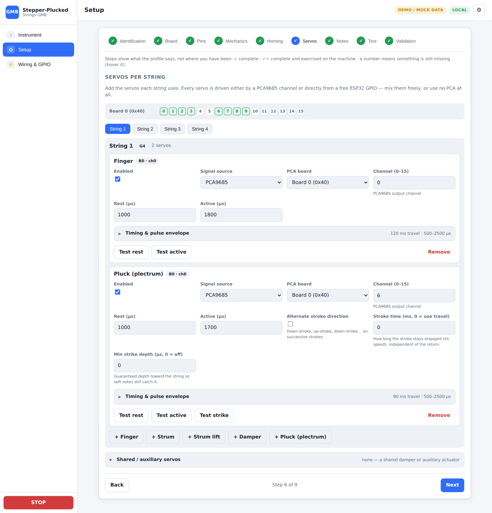 |
| 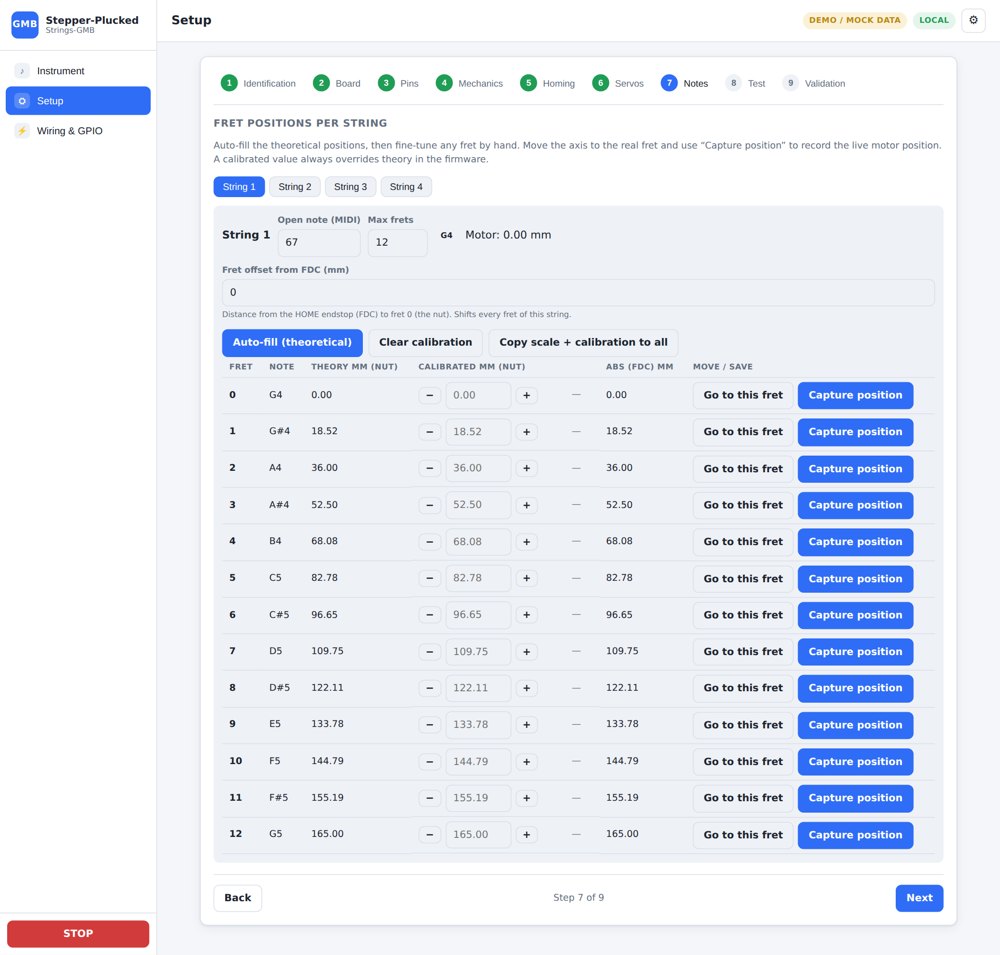 | 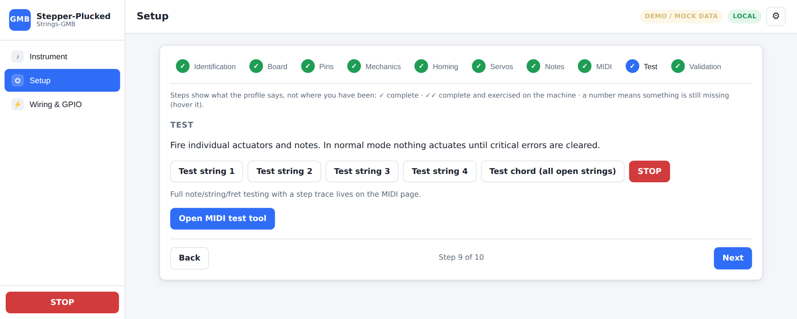 |
| 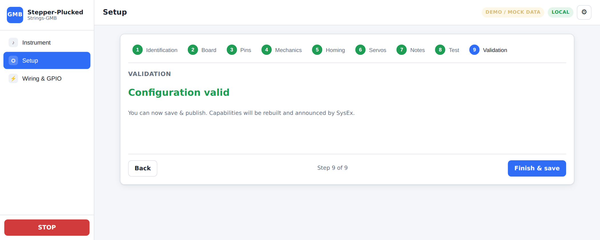 | |

</details>

### 3.1 Step status, and what it gates

Each step carries a state **derived from the profile**, not from how far you have
clicked: a step you walked past without filling in is not done, and a step you
fixed later stops nagging without being revisited.

| Mark | Meaning |
| ---- | ------- |
| a number | something this step owns is missing — hover it for the reason |
| ✓ | complete |
| ✓✓ | complete **and** exercised against the machine in this session |

"Exercised" is session-scoped and never saved: it means *I saw this work just
now*, and persisting it would let a stale claim outlive the wiring change that
invalidated it.

Navigation stays free — every step is always open — but an incomplete step
**gates the actions that move metal**. *Home all axes now* is inert while any
enabled axis has no HOME sensor, because the only thing that would then stop that
carriage is the search-distance timeout at the end of its travel; a jog is inert
without STEP/DIR/HOME; a string test is inert without a striker. A blocked button
stays clickable and explains itself when pressed — a disabled button answers no
questions. This is on top of the firmware's own refusal, which remains the actual
guarantee.

### 3.2 The fret calibration assistant

Calibration is a sequence, so the screen is one. The old layout was a table of
every fret with a move and a capture button on each row: on a 6×20 guitar that is
120 rows and 240 equally-prominent buttons, with nothing showing where you were
or whether the last capture was sane.

One fret at a time instead, showing **theory, target, measured and live position
side by side** plus the **Δ against theory** — colour-coded, because a few tenths
is normal mechanical reality and several millimetres means the carriage was not
where you thought, and catching that at capture time is the entire point. A rail
of fret numbers marks what is already measured and jumps anywhere. *Move to
fret*, a ±0.5 mm nudge, *Capture position* and *Next fret* are the whole loop.

The full table is still there, folded away: reviewing a finished calibration and
bulk editing are real tasks that a one-at-a-time flow is bad at.

The step-by-step walkthrough is in [`FIRST_CONFIGURATION.md`](FIRST_CONFIGURATION.md);
the maths behind steps 4–7 is in [`CALIBRATION.md`](CALIBRATION.md).

---

## 4. Wiring & GPIO

Five sub-tabs. Everything is derived live from the profile being edited, so the
pictures change with every choice made on the Setup page.

### 4.1 Harness

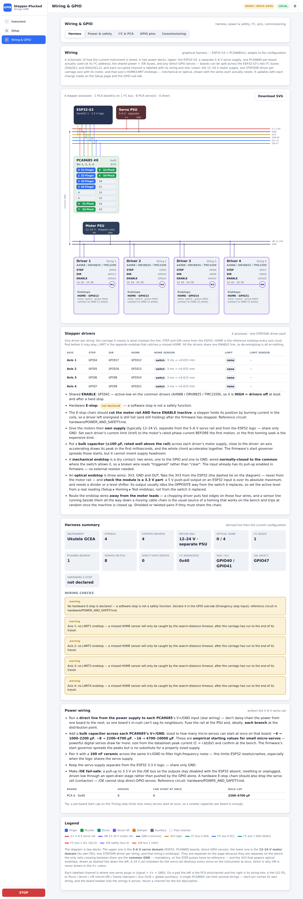

The electrical harness of the *current* instrument: the ESP32, one STEP/DIR
driver per axis, a separate 5–6 V servo supply, one PCA9685 per board actually
used at its real I²C address with every occupied channel labelled by string and
role, the shared power + `/OE` buses, and any direct-GPIO servos. Boards can be
split across the ESP32-S3's two I²C buses.

The **Stepper drivers** card below the diagram is a point-to-point table (STEP /
DIR / HOME / LIMIT per axis, plus the shared ENABLE) with the driver-specific
advice: ENABLE is active-low, the E-stop must *also* force it inactive, set Vref
before the first motion, give the motors their own supply.

It flags real faults live: a duplicated board+channel, two servos on one GPIO, a
missing SDA/SCL for a bus in use, a missing `/OE` or `ENABLE`, a missing
STEP/DIR/HOME on an enabled axis (errors), and a missing LIMIT endstop or a
normally-open E-stop (warnings). **Download SVG** saves the diagram for the
workbench.

### 4.2 Power & safety

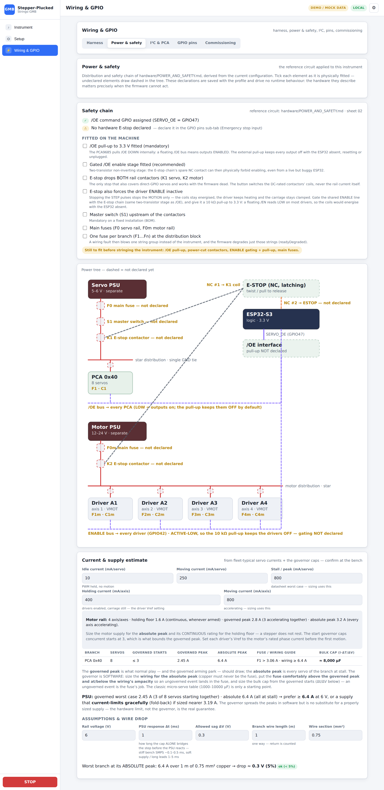

[`hardware/POWER_AND_SAFETY.md`](../hardware/POWER_AND_SAFETY.md) applied to your
configuration: the power tree with undeclared elements dashed, the E-stop / `/OE`
chain status, and a current estimator that sizes fuses, wiring, PSU and bulk
capacitors from your own servo and stepper currents.

The **motor rail is budgeted separately**, because it is a different kind of
number: a stepper burns its phase current the whole time the instrument is armed,
so the holding floor is *continuous*, not a peak.

What is physically fitted (pull-up, contactor, fuses, ENABLE gating) is declared
here and **stored with the profile**, so the builder's declarations follow the
instrument across devices and exports.

### 4.3 I²C & PCA

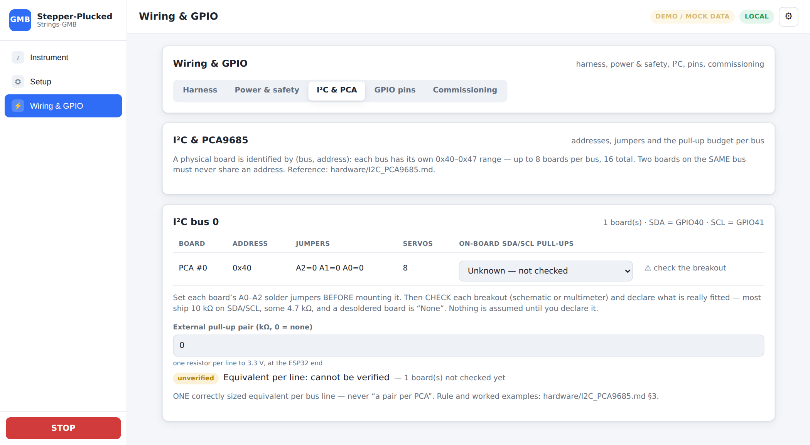

Buses, board addresses and their A0–A2 jumpers, and the equivalent pull-up
resistance per bus — the number that decides whether a long harness still works.

### 4.4 GPIO pins

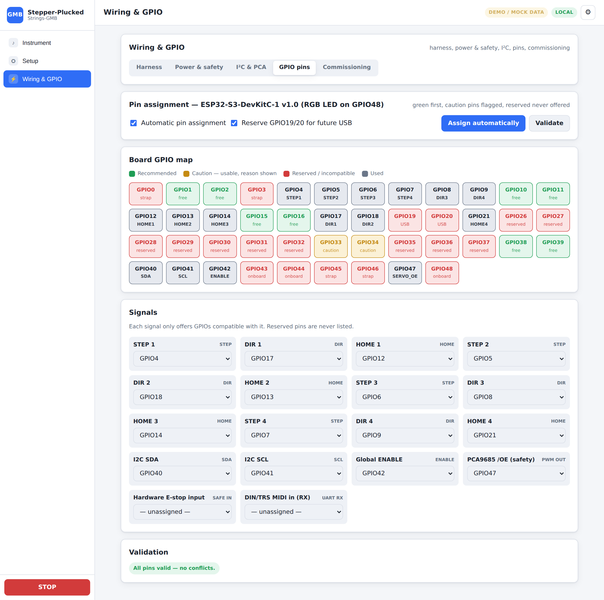

The pin-assignment grid with per-signal capability filtering and live validation.
Colours and rules come from the board profile — see
[`PIN_CONFIGURATION.md`](PIN_CONFIGURATION.md).

### 4.5 Commissioning

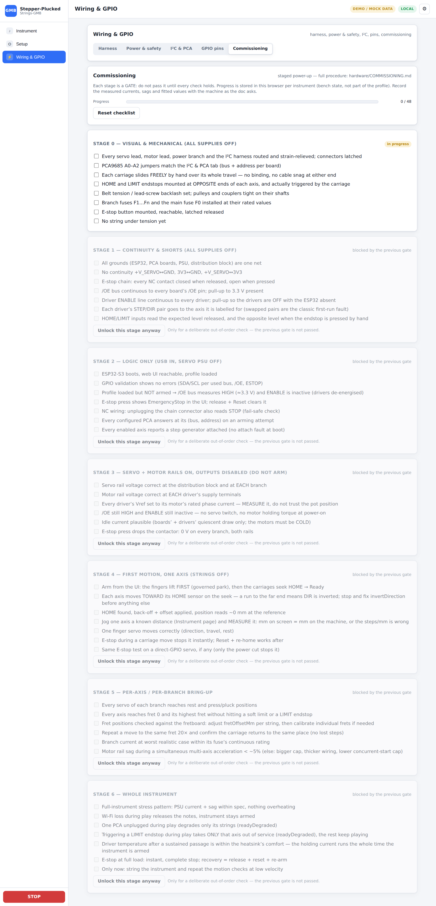

[`hardware/COMMISSIONING.md`](../hardware/COMMISSIONING.md) as a live checklist:
seven staged gates from "everything off" to a strung instrument, each of which
must hold before the next supply goes on. Progress is kept in the browser per
instrument (bench state, not configuration), so it survives a reload without
touching the profile.

---

## 5. Settings modal

Five tabs, split strictly by **what a thing belongs to**. Mixing those categories
is what produced two editors for the Wi-Fi (only one of which could apply
anything) and a complete profile library that no route reached:

| Tab | Category |
| --- | -------- |
| **Profiles** | the instrument **library** — slots, startup slot, import/export |
| **Network** | **device**: link config and credentials, applied live |
| **Security** | **device**: admin token and the network-MIDI source policy |
| **Diagnostics** | read-only runtime telemetry |
| **Tools** | bench tools: SysEx identity & tester, MIDI monitor, note tester |

Building an instrument is not in here at all — that is the Setup page.

### 5.0 Profiles

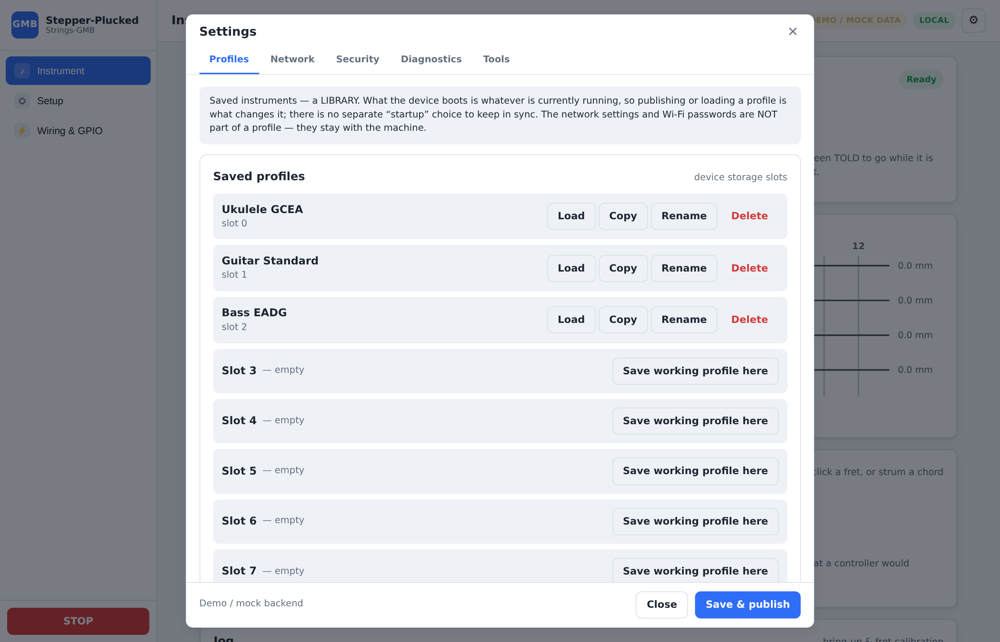

Saved instruments, one per device storage slot: load, copy, rename, delete, pick
the **startup slot**, import and export. The network settings and Wi-Fi passwords
are deliberately *not* part of a profile — they stay with the machine, so moving
an instrument between devices never moves one machine's SSID onto another.

### 5.1 Network

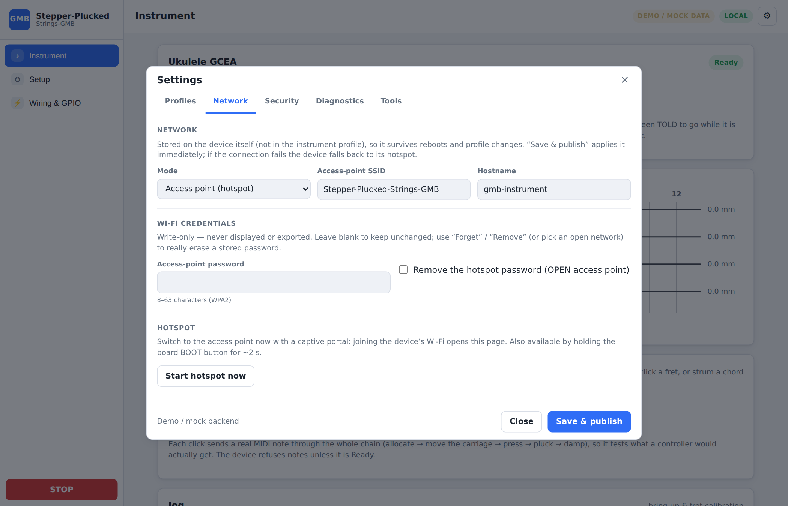

Device Wi-Fi: station or access point, SSID (with a live survey — `GET
/api/wifi/scan`), hostname, AP name, and passwords, which are **write-only** and
never leave the device.

This is **the only place the network is configured**. The link config belongs to
the machine, not to the tune: it is stored in NVS beside the passwords and
overrides whatever an imported profile carries, so moving a profile between
machines never moves one machine's SSID onto another, and loading another
instrument never drops the device off the network. The Setup wizard used to carry
a second copy of these fields (plus a `staticIp` checkbox for a flag that drove no
`WiFi.config()` call and was removed from the schema in v2); it now links here.

**Save & publish** stores the settings *and applies them* — `POST /api/wifi` with
`apply: true` makes `loop()` reconfigure the radio, with the usual automatic
fallback to the hotspot if the station attempt fails, so a wrong SSID costs a
fallback rather than a lockout. A blank password field means "keep the stored
one"; erasing a secret is a separate, explicit **Forget** / **Remove** checkbox.
The toast reports what the device actually did, not what was requested.

A **Start hotspot** button switches to the access point with its captive portal on
demand — the web twin of holding the BOOT button for two seconds, for when the
station link is unreachable. See [`NETWORK_HOTSPOT.md`](NETWORK_HOTSPOT.md).

### 5.2 Diagnostics

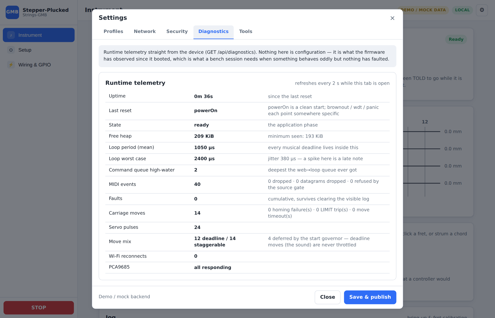

`GET /api/diagnostics`, refreshed every 2 s while the tab is open. This is not
configuration — it is what the firmware has observed since it booted, which is
what a bench session needs when something behaves oddly but nothing has faulted:

* uptime and **reset reason** (`powerOn` is a clean start; `brownout` / `wdt` /
  `panic` each point somewhere specific);
* **loop period, worst case and jitter** — every musical deadline lives inside
  this, so a spike here is a late note;
* command-queue high-water, MIDI events with dropped / refused counts;
* **carriage moves, homing failures, LIMIT trips and move timeouts**;
* the **move mix** — how many movements were deadline (the sound, never
  throttled) versus staggerable, and how many the start governor deferred;
* free and minimum heap, Wi-Fi reconnects, per-board PCA9685 health.

The body is built by the firmware's main loop and only *copied* by the web task,
so reading it never touches the I²C bus or a live counter.

### 5.3 Security

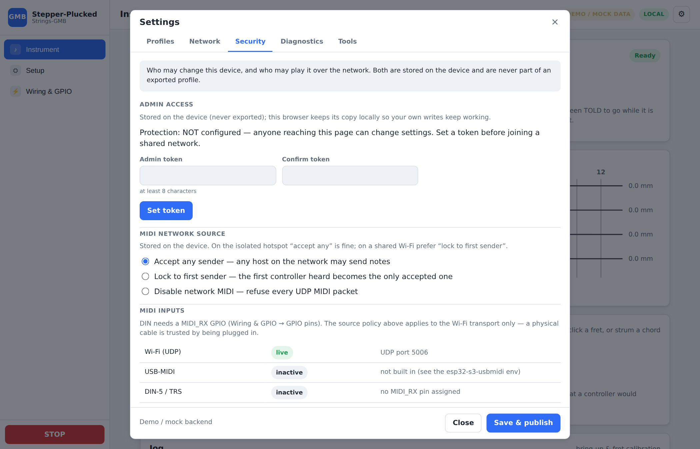

Who may change this device (the **admin token** — write routes answer 401 without
it, and `POST /api/panic` never requires it), and who may play it over the
network (the **UDP source policy**: accept any sender, lock to the first
controller heard, or refuse network MIDI entirely). Both live on the device and
are never part of an exported profile.

### 5.4 Tools

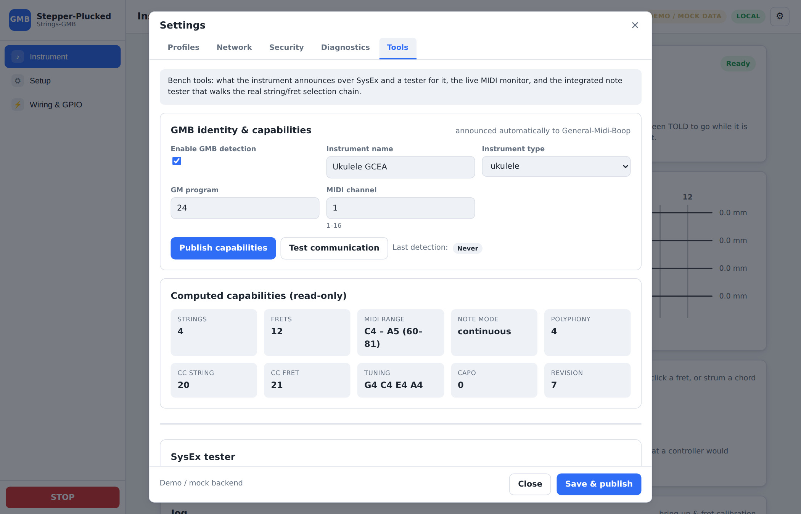

The GMB identity and capabilities with its SysEx tester, the live MIDI monitor,
and the integrated note tester. These are diagnostics, not configuration.

The **integrated test tool** sends the two selection CC *values* a controller
would put on the wire, and the firmware decodes them with the live selector
config — numbering, offset, reverse order, mapping table and all — before the
Note On. So the tool really exercises the General-Midi-Boop chain: if the mapping
is wrong, the wrong carriage moves, which is the thing worth finding out. The
header shows which axis and fret the current values resolve to; unticking **Send
selection CCs** falls back to a bare Note On, allocated automatically.

| | |
| --- | --- |
| 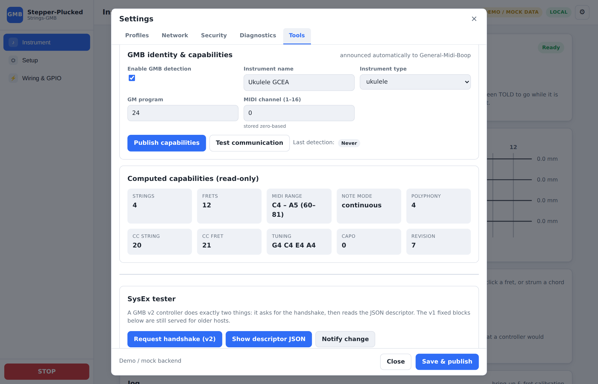 | 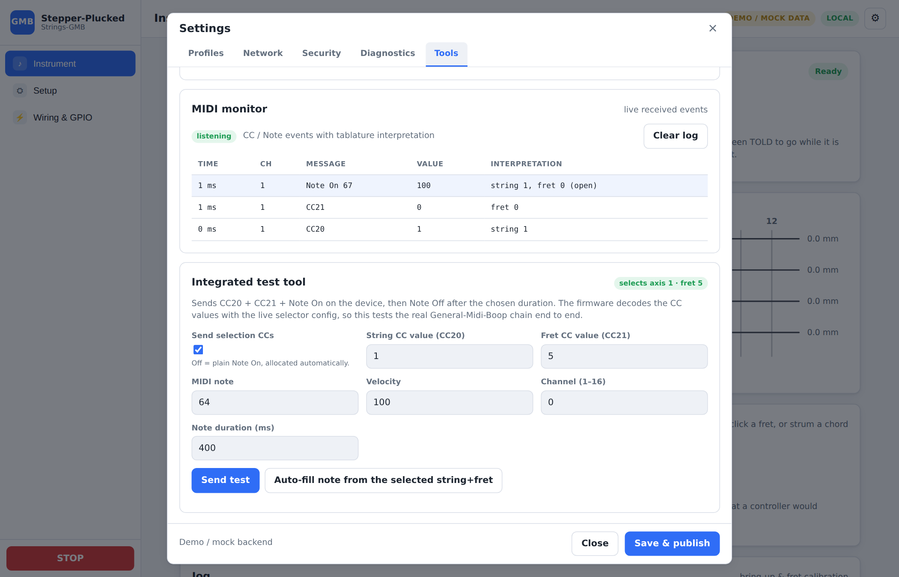 |

---

## 6. Regenerating the screenshots

The UI falls back to its in-memory mock backend when no device answers, so
opening `web-interface/index.html` from `file://` gives a complete, deterministic
demo instrument. `web-interface/tools/screenshots.js` drives it with Playwright:

```bash
npm i playwright && npx playwright install chromium
node web-interface/tools/screenshots.js
```

Set `CHROMIUM_PATH` to use an already-installed Chromium and `PLAYWRIGHT_MODULE`
to point at a Playwright installed outside the repo:

```bash
PLAYWRIGHT_MODULE=/path/to/node_modules/playwright \
CHROMIUM_PATH=/path/to/chrome \
node web-interface/tools/screenshots.js
```

Keep the file names stable — they are referenced from this document and from
`README.md`.

Before regenerating, run the browser smoke test — it mounts every view, every
Setup step, every Wiring sub-tab and every Settings tab, and fails on a page
error or a rendered “View error” card:

```bash
node web-interface/test/smoke.js       # same env vars as above
```

It exists because `node --check` and `test/run-tests.js` cannot catch a view
that calls a function which does not exist: the render throws, the shell paints
an error card, and every other check still passes. That is exactly how the
Power & safety tab once shipped broken.

---

## 7. REST / WebSocket API

### 7.1 REST endpoints

| Method | Endpoint | Role |
| ------ | -------- | ---- |
| `GET` | `/api/status` | overall status + per string (the Instrument page and the live pills) |
| `GET` | `/api/diagnostics` | runtime telemetry snapshot (§5.2) |
| `GET` | `/api/profile` | active profile (flat interchange JSON) |
| `PUT` | `/api/profile` | replace the profile (draft → validation → activation) |
| `GET` | `/api/profiles` | list of saved profile slots |
| `POST` | `/api/profiles` | save a profile to a slot (optionally as the startup slot) |
| `GET` | `/api/boards` | the boards this firmware supports (the Setup board picker) |
| `GET` | `/api/board/{id}` | board profile + full GPIO capabilities (colours, filtering) |
| `POST` | `/api/pins/auto` | automatic assignment (`PinRequest`) → assignments |
| `POST` | `/api/pins/validate` | pin validation → list of `PinError` |
| `POST` | `/api/panic` | software panic — **never authenticated** |
| `POST` | `/api/reset` | clear a latched panic / E-stop, then re-home |
| `POST` | `/api/test/note` | play a test note (channel, note, velocity, duration; optional `ccString`/`ccFret` selection values) |
| `POST` | `/api/test/servo` | drive one servo to rest/active (armed only) |
| `POST` | `/api/test/jog` | nudge one axis by a signed mm delta (armed only) |
| `POST` | `/api/test/moveto` | send one axis to an absolute mm from the homing zero (armed only) |
| `POST` | `/api/test/endstop` | read a HOME/LIMIT sensor for one axis |
| `GET` | `/api/commands?id=N` | outcome of a 202-accepted command |
| `POST` | `/api/auth/check` | does this token authorise writes? |
| `POST` | `/api/hotspot` | switch to the access point + captive portal now |
| `GET` | `/api/wifi/scan[?start=1]` | asynchronous network survey |
| `POST` | `/api/wifi` | device network settings: mode/ssid/apSsid/hostname, passwords (write-only), `clearStationPassword`/`clearApPassword`, `apply` |
| `POST` | `/api/sysex/request` | run a GMB SysEx request → decoded response |
| `GET` | `/api/capabilities` | current capabilities snapshot (read-only) |

### 7.2 WebSocket

| Channel | Role |
| ------- | ---- |
| `WS /ws/midi` | inbound MIDI stream (the MIDI monitor) |
| `WS /ws/status` | live status and per-string state (the Instrument page) |

### 7.3 Notes

* **Every mutating request only ENQUEUES a command**; `loop()` is the sole owner
  of the mechanical state and executes it. So a `202` means *accepted*, not
  *done* — poll `GET /api/commands?id=N`, which reports `queued` / `running` /
  `succeeded` / `refused` / `cancelled` / `failed`. A profile activation is
  deliberately `running` until the new profile really reaches `Ready`; a panic
  purges the queue and the purged commands read back `cancelled`, not a `queued`
  ghost that a client would poll to its timeout.
* `PUT /api/profile` follows draft → `ProfileValidator` → atomic save →
  `capabilitiesRevision` increment → snapshot rebuild → Block 8 notification (see
  [`MIDI_PROTOCOL.md`](MIDI_PROTOCOL.md) §3.7). A draft is **never** published.
* Writes require the `X-GMB-Token` header once an admin token has been set; until
  then they are open (first-run bootstrap). `POST /api/panic` is exempt.
* `POST /api/pins/auto` and `/api/pins/validate` map directly to
  `PinManager::autoAssign` / `validate` — see
  [`PIN_CONFIGURATION.md`](PIN_CONFIGURATION.md).
* Profile **slots on disk** use a split `device` / `instrument` layout, while
  this interchange format stays flat and unchanged — see
  [`DEVICE_INSTRUMENT.md`](DEVICE_INSTRUMENT.md).
